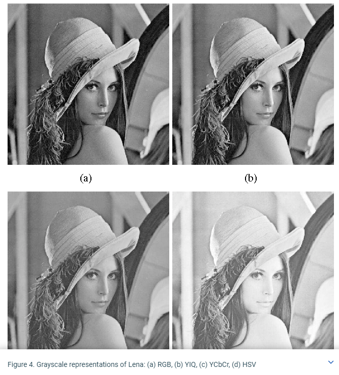

# Jest-Boilerplate

## Introduction

Light and simple Jest-based boilerplate repo to quickly get you up and running when doing algorithm quizzes/katas.

## Prerequisits

You need to have NodeJS installed. If you don't check out the [official NodeJS documentation][node-installation].

## How to install

_`npm i` to install dependencies_

## How to run

_`npm test` to run tests_

Current settings have Jest running with the `--watchAll` flag; which reruns the test on save (when a file has changed).

## Resources

- [Jest API documentation][jest-documentation]

[node-installation]: https://nodejs.org/en/download/
[jest-documentation]: https://jestjs.io/docs/api
